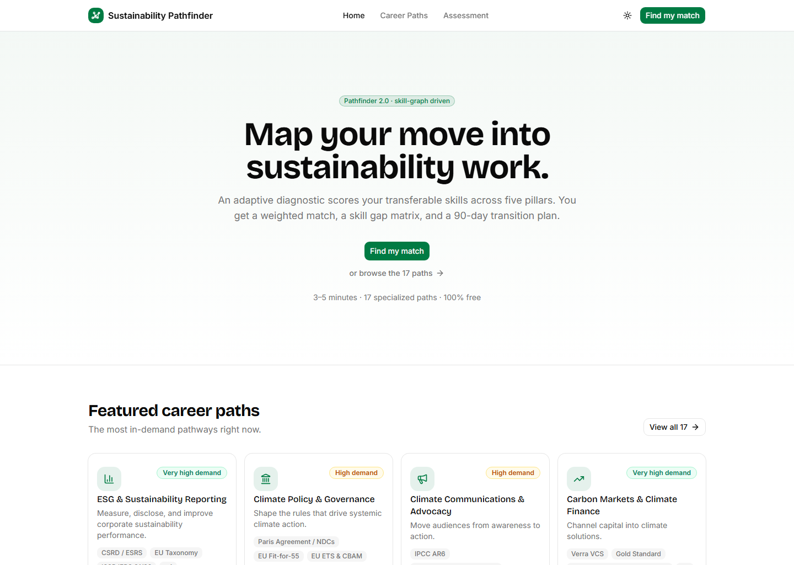

# Sustainability Career Pathfinder 2.0

A career recommendation engine for sustainability professionals. A four-step diagnostic scores your transferable skills against a five-pillar skill graph, credits the skills your background already proves, and ranks 17 career pathways by weighted fit. Every match comes with a transparent "why this match" breakdown, a skill gap matrix, and a 90-day transition plan. Free, no account required, drafts save on your device.

**Live:** [https://sustainability-career-pathfinder20.vercel.app/](https://sustainability-career-pathfinder20.vercel.app/)



## From 1.0 to 2.0

The original [Sustainability Career Pathfinder](https://sustainabilitypathfinder.lovable.app/) (MVP 1.0) mapped the 17-pathway taxonomy and the roadmap content this project builds on. Version 2.0 is a ground-up rebuild that answers its three biggest gaps: a static quiz, generic results, and no execution path.

| MVP 1.0 | Pathfinder 2.0 |
| :--- | :--- |
| Static quiz, opens with demographics | 4-step adaptive diagnostic on background, skills, region and work style |
| Generic text recommendations | Deterministic weighted scores across all 17 paths |
| No gap analysis | Skill delta matrix: transferable, critical gaps, upskilling, background credits |
| No explainability | "Why this match" card showing the score math line by line |
| Generic roadmaps | 90-day plan built from the matched path's projects and certifications |

## What's built

- 17 career path profiles, statically generated with JSON-LD breadcrumbs
- 4-step adaptive assessment: background, technical skills, region and frameworks, working style
- CV prefill: upload a PDF or paste CV text on Step 1 to auto-detect skills (parsed in your browser; the file never leaves your device), review the matches, then continue the wizard
- Match engine: weighted skill coverage, mandatory-gap penalty, background skill credits at half weight, region and work-style bonuses, capped at 99
- Results: top 3 matches, five-pillar radar, skill delta matrix, entry/mid/senior pivot framing, 90-day plan
- "Why this match" card: coverage %, gap penalties, credits and bonuses itemized
- Shareable results: copy a link that re-computes your exact matches for anyone who opens it, or save a one-page PDF via the browser print dialog
- Path explorer with live search, demand and pillar filters, removable filter chips
- Dark mode (light / dark), Inter + Bricolage Grotesque type system
- Seed data: 17 paths, 129 skills, 68 portfolio projects, 52 certifications

## Tech stack

Next.js 15 (App Router, Turbopack) · TypeScript · Tailwind CSS v4 · shadcn/ui (Base UI) · Zustand · Recharts · next-themes

## Getting started

Requires Node 20+.

```bash
npm install
npm run dev      # dev server at http://localhost:3000
npm run build    # production build (runs lint + typecheck)
npm run start    # serve the production build
```

## Docs

- `sustainability_career_pathfinder_2_0_plan.md`: product and implementation spec, including the PostgreSQL schema, matching algorithm and differentiation roadmap
- `career_paths_knowledge_base.md`: content source of truth for all 17 pathways; Appendix A maps each field to the database schema for future Supabase seeding

## Roadmap

Built: diagnostic, match engine with background credits and region/work-style bonuses, explainable results, path pages

Next: dynamic OG share cards, framework index page, certification ROI directory, proof-of-work starter kit downloads

Phase 3: Supabase auth, LLM-assisted resume translation, portfolio gallery
